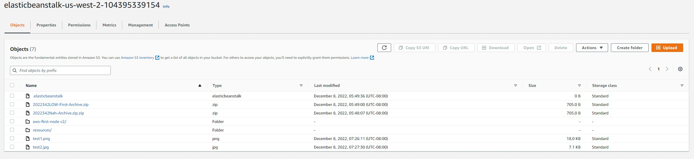
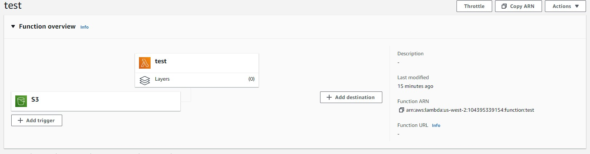
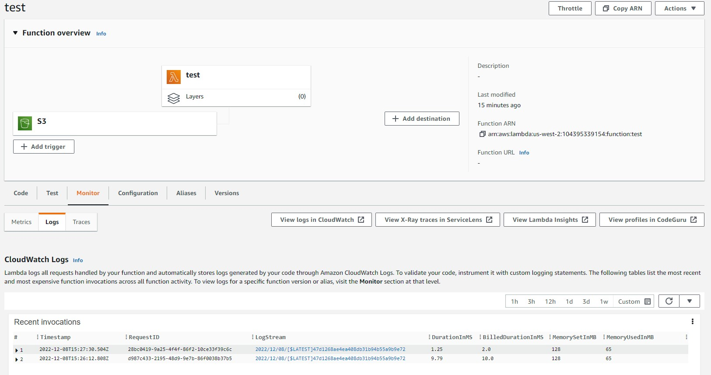
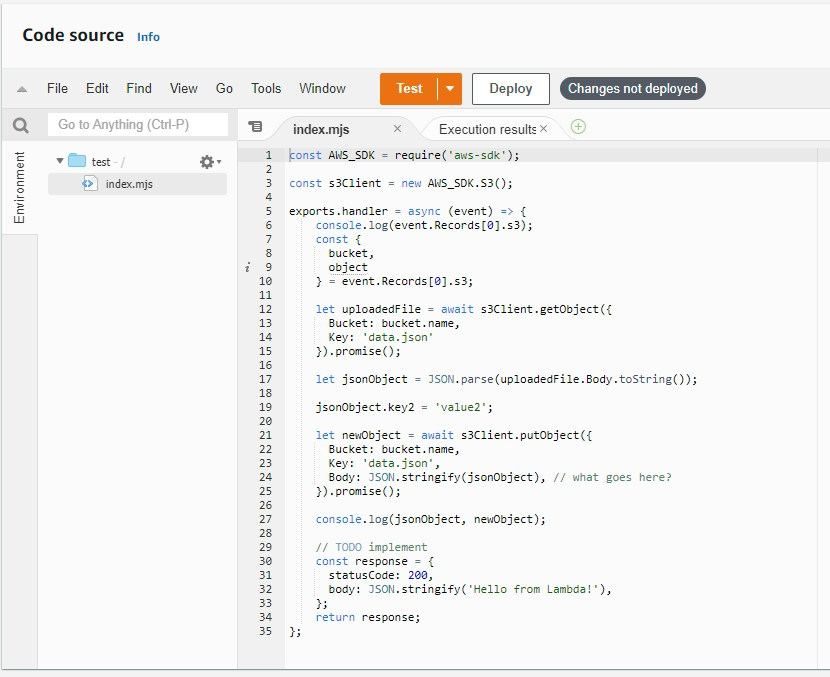

# Documentation

## How to use

- The lambda will be called upon when a new img, png, or svg file is uploaded to the S3 bucket linked to it. 

## Issues Encountered

- I had issues getting everythign linked up at first, I finally got the bucket to register with the lambda function. My image.json file didn't seem to work when i started altering to coded for speciofic parameters, so i reverted back to the original code and testing. Below are pictures of my AWS setup.

## Images

- S3 Bucket
</img>

- S3 Bucket linked to Lambda
</img>

- Test logs
</img>

- Lambda code
</img>

## Link

- [URL Link for public JSON](https://elasticbeanstalk-us-west-2-104395339154.s3.us-west-2.amazonaws.com/images/test2.jpg)